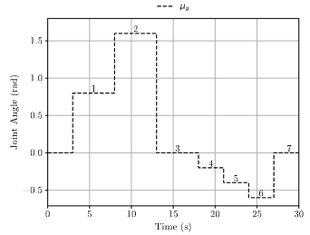

# Reactive Active Inference Control (ReAIC) of an Interbotix PincherX 150 Robotic Manipulator 🦾

This repository contains code focused on enhancing the Active Inference Controller (AIC) developed in [^1] for robotic manipulation tasks. Specifically, a modified version of the AIC, called the Reactive Active Inference Controller (ReAIC), was implemented and evaluated on an [Interbotix PincherX 150](https://docs.trossenrobotics.com/interbotix_xsarms_docs/specifications/px150.html) 5-DOF manipulator using ROS (Robot Operating System). Additionally, several other controllers, including the original AIC [^1], the classic PID controller and an Adaptive Friction Compensator (AFC) [^2] were implemented for comparison.

The code within this repository was adapted from the [THIS GitHub repository](https://github.com/cpezzato/panda_simulation/tree/master), in which the author implemented an AIC controller to control a 7-DOF Franka Emika Panda robot arm for their study [^1]. The code was changed to suit the control of a real 5-DOF Interbotix PincherX 150 robotic manipulator with different control algorithms. 

<div align="center">
  
</div>
<div align="center">
  <em>Interbotix PincherX 150</em>
</div>


## Performance Comparison - ReAIC vs. AIC
<div align="center">
   

  <em>ReAIC</em>

  

  <em>AIC</em>
</div>

## ReAIC

### Tuning Parameters:

The ReAIC requires seven tuning parameters per joint, which may seem like a lot; however, only three of the seven would require delicate tuning. The tuning parameters are:

- $\sigma_{q}$, $\sigma_{\dot{q}}$, $\sigma_{\mu}$, $\sigma_{\mu'}$: Gaussian noise variances in the generative model of the sensory data $\sigma_{q}, \sigma_{\dot{q}}$ and the reference state dynamics $\sigma_{\mu}, \sigma_{\mu'}$. These variances represent the confidence in the controller's sensory position and velocity input and the confidence in the reference velocity and acceleration, respectively [^1].

- $\kappa_{\mu}$, $\kappa_{a}$: The gradient descent learning rates for the reference state update and control actions, respectively. These are responsible for how fast the VFE is minimised through perception and action. Larger learning rates allow for a faster minimisation, although this can also cause gradient descent overshoot.

- $𝓚_{p}$: The proportional parameter that distinguishes the ReAIC from the AIC defined in [^1]. It influences the reference model speed at which the joints should be steered toward the goal position $\mu_{g}$.

### Tuning Procedure:

1) The variances $\sigma_{q}, \sigma_{\dot{q}}, \sigma_{\mu}, \sigma_{\mu'}$ and the proportional parameter $𝓚_{p}$ are set to one, indicating high confidence in both the sensory input and reference state and setting a slow settling time.

2) The control actions are disabled by setting the learning rate $\kappa_{a}$ to zero.

3) The learning rate for the reference state update $\kappa_{\mu}$ is incremented such that the state estimate converges to a stable value in a static case within 20 - 30 ms. This is done by plotting the reference joint position $\mu$ during a step response while the control action has been disabled.

4) A desired settling time $t_{s}$ can be set by increasing the proportional parameter $𝓚_{p}$ with the following formula:
    
    $𝓚_{p} = \frac{5(\mu_{g}-y_{q})}{t_{s}}$  

    Increasing $𝓚_{p}$ to large values will result in overshoot behaviour in the real system. It is suggested to start with a reasonable desired settling time.

5) Increment the control action's learning rate $\kappa_{a}$ to allow the joint to be steered to the goal. A large learning rate is preferable for the controller to cope with changes in the sensory input as quickly as possible. However, increasing it too much will result in oscillatory behaviour due to overshooting the gradient descent operation. 

5) If the system response continues to exhibit oscillatory behaviour despite increasing $𝓚_{p}$ and decreasing $\kappa_{a}$, adjusting the variances of the noisiest sensors and the reference state of the higher-order generalized motions becomes necessary to reduce their sensory confidence. When a large $𝓚_{p}$ is chosen, lowering the confidence in the higher-order generalized motion, denoted as $\sigma_{\mu'}$, becomes crucial. This is because the control actions will attempt to control the real manipulator joint (second-order system) using the first-order reference model at large velocities and accelerations. Therefore, the confidence in the reference model acceleration should be decreased. 


## Structure

``` bash
interbotix_aic_control/
│
├── src/
│   ├── AFC_controller.cpp
│   ├── AIC_controller.cpp
│   ├── PID_controller.cpp
│   ├── ReAIC_controller.cpp
│   ├── uAIC_controller.cpp
│   ├── OL_step_response.cpp
│   └── classes/
│       ├── AFC.cpp
│       ├── AIC.cpp
│       ├── PID.cpp
│       ├── ReAIC.cpp
│       └── uAIC.cpp
│
├── include/
│   ├── AFC.h
│   ├── AIC.h
│   ├── PID.h
│   ├── ReAIC.h
│   ├── uAIC.h
│
├── config/
│   ├── AFC_tuning.yaml
│   ├── AIC_tuning.yaml
│   ├── PID_tuning.yaml
│   ├── ReAIC_tuning.yaml
│   └── uAIC_tuning.yaml
│    
├── launch/
│   ├── AFC_control.launch
│   ├── AIC_control.launch
│   ├── PID_control.launch
│   ├── ReAIC_control.launch
│   ├── uAIC_control.launch
│   └── Step_control.launch
│
├── bagfiles/
│   ├── tuning/
│   │   ├── ...
│   ├── waist/
│   │   ├── ...
│   ├── wrist_ang/
│   │   ├── ...
│   └── wrist_rot/
│       ├── ...
│
├── README.md
└── LICENSE
```

## Setup
All experiments were executed using [Ubuntu 20.04](https://releases.ubuntu.com/focal/) OS and [ROS Noetic](https://wiki.ros.org/noetic).

Create a ROS workspace by navigating to the desired directory where you will store all your code, then execute the following:

```bash
source /opt/ros/noetic/setup.bash
```

```bash
mkdir ./interbotix_pincherX_ws/src
cd ./interbotix_pincherX_ws/
catkin_make
```

```bash
source devel/setup.bash
```

### Setting-up [Interbotix X-Series Arm Packages](https://github.com/Interbotix/interbotix_ros_manipulators/tree/main/interbotix_ros_xsarms):
Please consult the Trossen Robotics [installation guide](https://docs.trossenrobotics.com/interbotix_xsarms_docs/ros_interface.html) for your specific setup. Make sure to save all packages within the `src/` directory of your workspace.

Additionally you will need the following package that contains support level ROS wrappers and robot interface modules:

```bash
git clone https://github.com/Interbotix/interbotix_ros_toolboxes.git
```
> [!NOTE]
> The default setups should be changed to suit your control method. In this case we used PWM to control the [Dynamixel Servo Motors](https://emanual.robotis.com/docs/en/dxl/x/xl430-w250/). \
> Navigate to `interbotix_xsarm_control/config/modes.yaml` and change `operating_mode: pwm`. \
>Navigate to `interbotix_xsarm_control/config/px150.yaml` and change `update_rate: 1000` in order to allow the joint states publishe to update at a rate of 1 kHz.

### Clone this repository:
In the `src/` directory of yout workspace clone this repository:

```bash
git clone https://github.com/AlonDawe/interbotix_aic_control.git
```

### Compile your workspace

Navigate to your workspace directory and run the following:

```bash
catkin_make
```

## Controlling the Robot 

In order to get the PincherX 150 up and running, run the following:

```bash
roslaunch interbotix_xsarm_control xsarm_control.launch robot_model:=px150
```

You should now be able to see the libe robot rendered in rviz.

Then run the following:

> [!CAUTION]
> The following launch file will make one specific joint move in the goal step maneuvers shown below. Please ensure that the robot has been placed in a position such that it will will not hit anything, and that you have made sure which joint will be controlled. This should be checked in both `interbotix_aic_control/src/ReAIC_controller.cpp` and `interbotix_aic_control/src/ReAIC.cpp`

<div align="center">
  
</div>

```bash
roslaunch interbotix_aic_control ReAIC_control.launch
```

## References

[^1]: C. Pezzato, R. Ferrari, and C. H. Corbato, “A Novel Adaptive Controller for Robot Manipulators Based on Active Inference,” IEEE Robotics and Automation Letters, vol. 5, pp. 2973–2980, Apr. 2020.

[^2]: K. Verbert, R. Toth, and R. Babuska, “Adaptive Friction Compensation: A Globally Stable Approach,” IEEE/ASME Transactions on Mechatronics, pp. 1–1, 2015.


